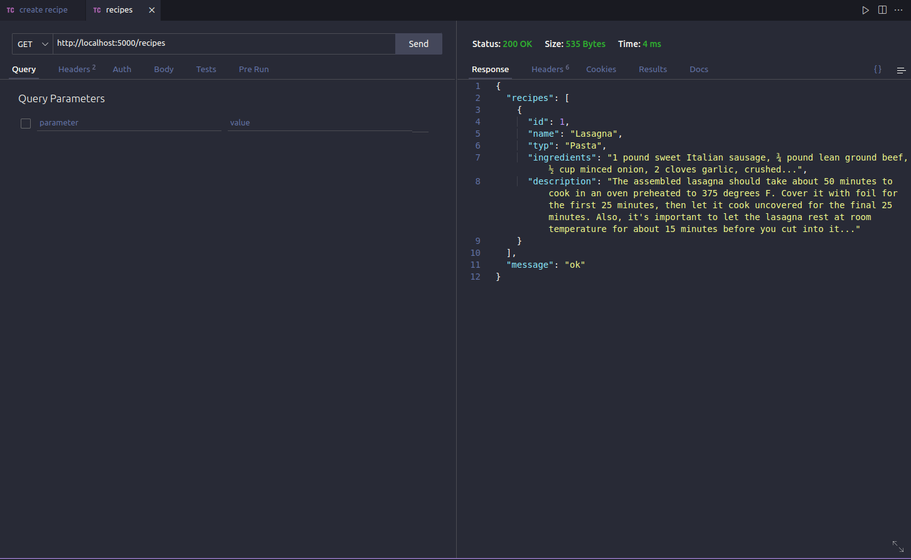
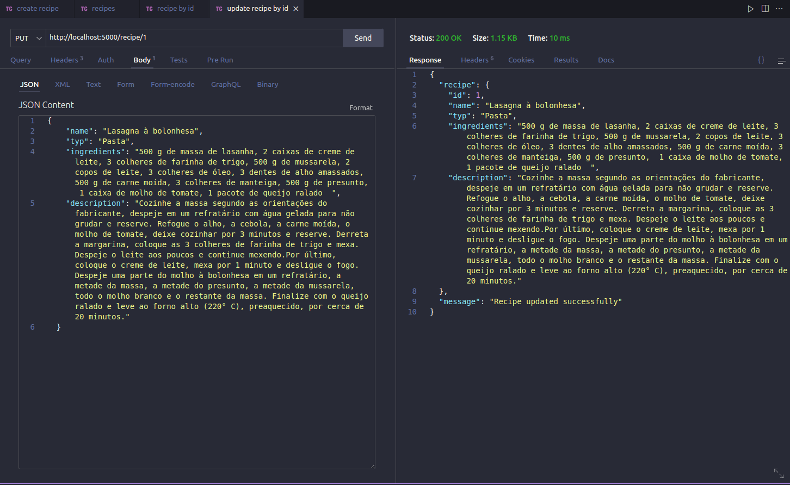

Este projeto contém os requisitos realizados por _[Anna Beatriz Garcia Trajano de Sá](www.linkedin.com/in/anna-beatriz-trajano-de-sá)_ enquanto cursava o curso de Pós-Graduação da PUC-RIO em Engenharia de Software. Ele engloba as disciplinas estudadas na primeira sprint (Desenvolvimento Full Stack Básico) e corresponde à parte Back-end da aplicação.

# My Recipes API

Neste projeto desenvolvi uma api de receitas, utilizando Flask!

Nele será possível ver, criar, filtar (por categoria) e deletar receitas!

Veja o exemplo a seguir das rotas criadas!

## Rotas

Create Recipe       
:-------------------------:|
  |

Get Recipes           |  Get Recipe By Id
:-------------------------:|:-------------------------:
  |  

Update Recipe          |  Delete Recipe
:-------------------------:|:-------------------------:
  |  


## Instalação do projeto localmente:
 
Após cada um dos passos, haverá um exemplo do comando a ser digitado para fazer o que está sendo pedido, caso tenha dificuldades e o exemplo não seja suficiente, não hesite em me contatar em _annagarcia@id.uff.br_.
Será necessário ter todas as libs python listadas no `requirements.txt` instaladas.

Após clonar o repositório, é necessário ir ao diretório raiz, pelo terminal, para poder executar os comandos descritos abaixo.

1. Abra o terminal e crie um diretório no local de sua preferência com o comando **mkdir**:
```javascript
  mkdir projetos
```

2. Entre no diretório que acabou de criar e depois clone o projeto:
```javascript
  cd projetos
  git clone git@github.com:annabiatrajano/my_recipes_api.git
```

3. Acesse o diretório do projeto e depois utilize o comando **pip install -r requirements.txt** para instalar todas as libs necessárias ( já com a virtualenv ativada ):
```javascript
  cd my_recipes_api
  (env)$ pip install -r requirements.txt
```

4. Para executar a API  basta executar:

```javascript
  (env)$ flask run --host 0.0.0.0 --port 5000 --reload
```
5. Por último, abra o [http://localhost:5000/](http://localhost:5000/) no navegador para verificar o status da API em execução.


## Habilidades Desenvolvidas

Neste projeto, desenvolvi as seguintes habilidades:

 - Estruturar uma API em Flask;
 - Fazer um CRUD;
 - Montar a documentação da API em Swagger;
